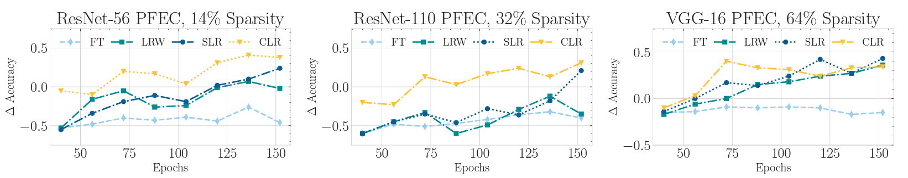

# Network Pruning that Matters: A Case Study on Retraining Variants

This repository contains the implementation of the paper [Network Pruning that Matters: A Case Study on Retraining Variants](https://openreview.net/forum?id=Cb54AMqHQFP).

[Duong H. Le](https://lehduong.github.io), [Binh-Son Hua](sonhua.github.io) (ICLR 2021)



In this work, we study the behavior of pruned networks under different retraining settings. By leveraging the right learning rate schedule in retraining, we demonstrate a counter-intuitive phenomenon in that randomly pruned networks could even achieve better performance than methodically pruned networks (fine-tuned with the conventional approach) in many scenariors. Our results emphasize the cruciality of the learning rate schedule in pruned network retraining – a detail often overlooked by practioners during the implementation of network pruning.

If you find the paper/code helpful, please cite our paper:

```
@inproceedings{
le2021network,
title={Network Pruning That Matters:  A Case Study on Retraining Variants},
author={Duong Hoang Le and Binh-Son Hua},
booktitle={International Conference on Learning Representations},
year={2021},
url={https://openreview.net/forum?id=Cb54AMqHQFP}
}
```

## How to Run

To run the code:

1. Copy the Imagenet/CIFAR-10 dataset to `./data` folder
2. Run `init.sh`
3. Download checkpoints [here](https://drive.google.com/file/d/1scu-mbzCFo6ZI18gM95srm6nS-MLO0jt/view?usp=sharing) then uncompress it here
4. Run the desired script in each subfolder.

## Acknowledgement

Our implementation is based on the official code of [HRank](https://github.com/lmbxmu/HRank), [Taylor Pruning](https://github.com/NVlabs/Taylor_pruning), [Soft Filter Pruning](https://github.com/he-y/soft-filter-pruning), [Rethinking](https://github.com/Eric-mingjie/rethinking-network-pruning).
